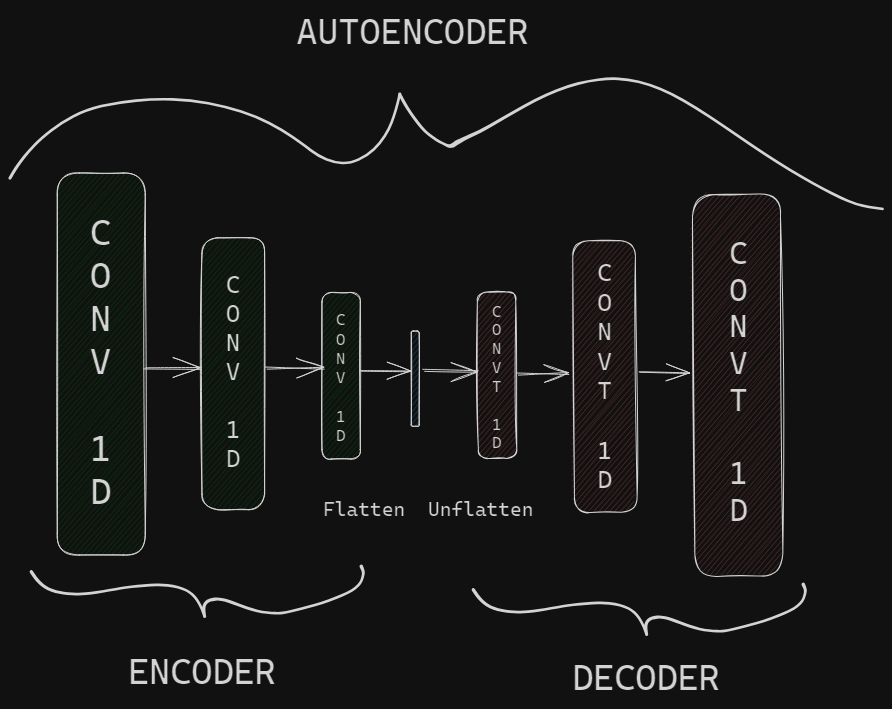
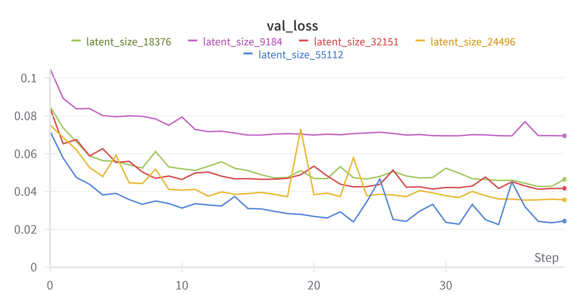
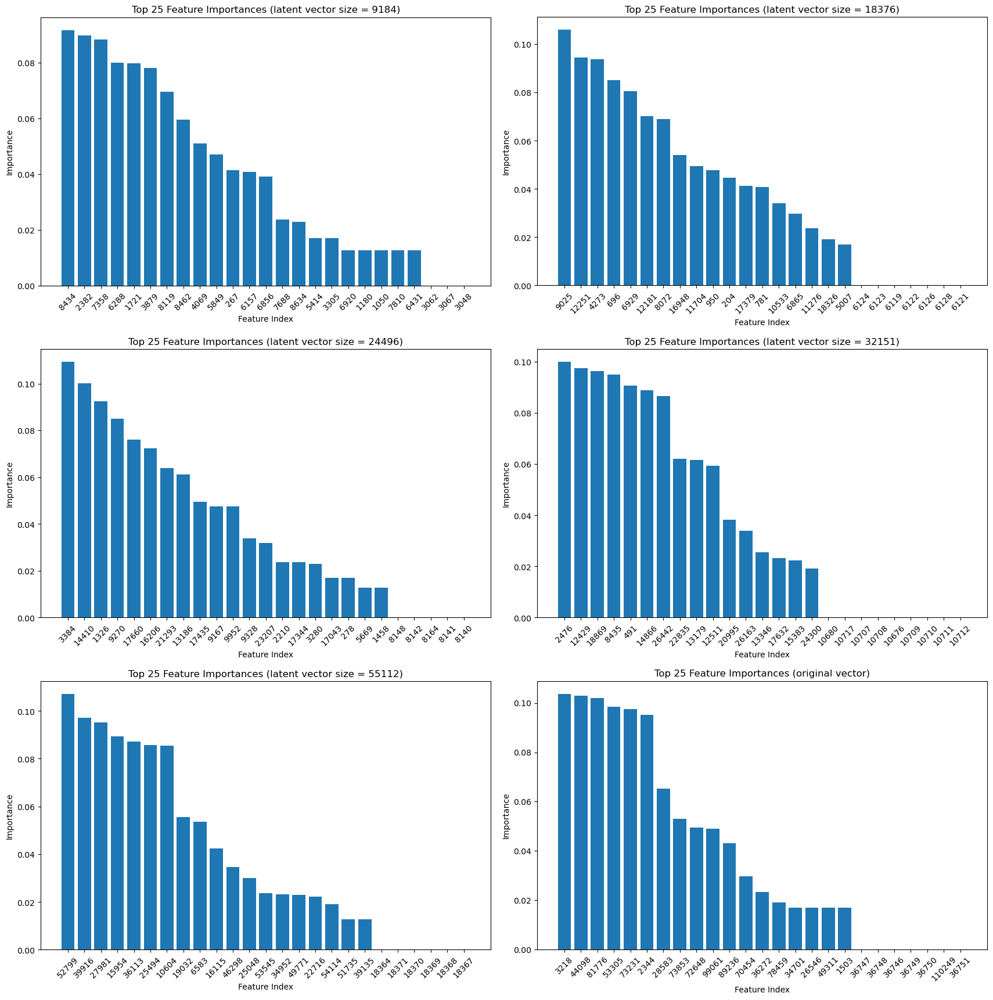

---
title: "Trabajo Práctico 4 - Encoders, decoders y autoencoders"
subtitle: "Tecnología Digital VI: Inteligencia Artificial"
author: [Federico Giorgi,Gastón Loza Montaña,Tomás Curzio]
date: "24/11/23"
geometry: "left=3cm,right=3cm,top=2.5cm,bottom=2.5cm"
lang: "es"
...

# Encodear canciones en vectores latentes

Para este primer inciso, utilizamos una red sencilla, muy similar a los autoencoders vistos en clase, utilizando la estructura que se puede ver en la figura 1.

{ width=350px }

{ width=350px }

En un principio, pudimos notar que la estrategia de hacer muchos canales en un inicio y luego disminuirlos no nos dió buenos resultados. Por ello, probamos ir disminuyendo de a poco o mantener los canales a lo largo de la red, para finalmente flattenear el vector y obtener así nuestro vector latente. Realizamos esto con distintos parámetros que nos dejaron vectores latentes de distintos tamaños, hasta llegar al punto de que la canción sea prácticamente irreconocible. Los audios resultantes se pueden ver en la siguiente tabla, que utiliza Music - Maddona como ejemplo.

¿Quizás agregar a la tabla los parámetros? (in/out channels, kernel size, stride, etc)

|    Vector latente     |   |
|:----------------------|--:|
| 1x110250 (Original)   | [$\textcolor{blue}{link}$](https://drive.google.com/file/d/13dINLPdNFMA_Rz2TYi6Tr5xfH0_xIw-c/view) |
| 1x55112               | [$\textcolor{blue}{link}$](https://drive.google.com/file/d/1cnege9wbLe6OsE1E8LDJliZn1zqfrBRD/view) |
| 1x32151               | [$\textcolor{blue}{link}$](https://drive.google.com/file/d/1jql5XVD3KKCA10C2dFdnZXvLSiJ9QSPX/view) |
| 1x24496               | [$\textcolor{blue}{link}$](https://drive.google.com/file/d/1UY3wKQtwLF5gk3JVnVQCwwSjJQL_2Dgl/view) |
| 1x18376               | [$\textcolor{blue}{link}$](https://drive.google.com/file/d/1he1mJwi92Qtt95sVPn0LRAQI-YC0MCfH/view) |
| 1x9184                | [$\textcolor{blue}{link}$](https://drive.google.com/file/d/1-8SM5pMs8vOZSLXxOH3wCtGWIl2ycoSL/view) |

En cuanto a los otros hiperparámetros, tomamos las siguientes decisiones.

- Decidimos dejar las epochs que venían por defecto en la notebook otorgada, por un tema de tiempo de cómputo, además de que observamos que la loss comenzaba a mantenerse bastante estable y no parecía tener mucha proyección a disminuir en futuras epochs.
- En cuanto al learning rate, corrimos un hyperopt con algunas iteraciones y el resultado obtenido (aprox 0.015) fue muy cercano al learning rate que venía por defecto en la notebook otorgada. Corrimos algunos experimentos con el learning rate obtenido y la diferencia era prácticamente nula, entonces a fines de poder comparar entre los distintos experimentos que ya habíamos realizado, decidimos mantener este parámetro en 0.02.
- No se me ocurre acá como explicar bien porque mantuvimos el batch size como venía.

Para no tener solamente una diferencia de audio como referencia, también observamos como difieren tanto la waveform como el espectograma de la canción original, con los de los distintos audios encodeados y luego decodeados, observados en la tabla. Estos fueron los resultados:

Acá pondría las imagenes de los waveforms y de los espectogramas, primero el del original y despues el de los demás en orden decreciente.

Observando y escuchando, decidimos quedarnos como "vector de mínimo tamaño posible" el de 1x18376, ya que consideramos que mantiene una similitud razonable con el audio original, a diferencia de el vector de 1x9184, que es prácticamente inentendible. Con esto, ya podemos avanzar a un análisis exploratorio de los vectores latentes obtenidos.

# Análisis exploratorio de vectores latentes

Para el análisis exploratorio de los vectores latentes procedimos a probar distintos métodos vistos a la largo de la materia que nos permita adquirir información interesante.

En primer lugar, exploramos qué resultaba de hacer un clustering con `k-medias`. Para ello, ejecutamos el algoritmo de la libería `sklearn` con valores crecientes de `k` para evaluar cómo varía la función que mide la variabilidad intra cluster para poder observar en cuántos clusters se podría dividir los vectores latentes, con la expectativa que sea una cantidad similar a la cantidad de géneros a los que pertenecen las canciones. Como se puede ver en la figura 2, aún con `k` igual a $40$ el modelo sigue con valores elevados de la función objetivo, y no se logra obervar ningún "codo" en el gráfico. Por lo tanto, es claro notar que aún los vectores latentes más chicos (de 9k), tienen demasiados atributos y por ende muchas dimensiones para que el algoritmo de `k-medias` puede encontrar una clustering relativamente chico. Por ese motivo, procedemos a analizar otras opciones.

{ width=450px }

Otro de los métodos que realizamos en esta exploración, es la análisis de componentes principales (PCA). Para ello, utilizamos el método ya provisto en `sklearn.decomposition` para ejecutar el análisis, habiendo previamente escalado los valores de los vectores, como se suele hacer antes de realizar un PCA.

Para observar resultado del análisis, decidimos graficar los vectores en el nuevo espacio vectorial dado las 3 componentes principales. Como podemos observar en la figura 3, para ninguno de los tamaños de vectores latentes ni para el original se observa una diferenciación clara entre las canciones. Esto muy probablemente se deba al mismo motivo por el que no funcionó `k-medias` dada la gran cantidad de atributos. Sin embargo, podemos notar que los "outliers" que se observan suelen ser los mismos para los diferentes tamaños de vectores latentes (canciones 61, 21 y 54 particularmente). Al escuchar estas canciones, no notamos ninguna característica que nos dé indicio del motivo de su diferenciación con respectoa a las demás canciones. Sin embargo, que coincidan los outliers nos da la idea que a pesar de ser vectores latentes encodeades con diferentes arquitecturas, conservan cierta información de manera similar.

Por último, para poder observar si la información relevante para la clasificación en géneros de las canciones se ve afectada o no por el proceso de codificación, procedemos a realizar para cada tamaño de vector latente y el vector original árboles de decisión para entrenar la clasificación de las canciones en géneros con `sklearn.tree`. Entrenando este clasificador, buscamos poder detectar cuáles y cuántos atributos utiliza el clasificador. Obtenemos esta información mediante el método `feature_importances_` y gráficamos en orden descente los atributos, en este caso coordenadas del vector, según su aporte en la clasificación en entrenamiento.

Como se puede observar en la figura 4, para el vector original y todos los tamaños de vectores latentes, se utilizan sólo entre 14 y 23 coordenadas de los vectores para la clasificación del género de las canciones. Por esta razón, podríamos suponer que la información relevante relacionada al género de las canciones se condensa en promedio en 20 atributos sin importar el tamaño del vector. Este aspecto parece relevante al cosiderar que los vectores latentes fueron obtenidos a tráves de encoders distintos y aún sí conservan información en común, como sucedió con los outliers del análisis de componentes principales.

# Encodeo de música nueva

Con la red definida, en un principio no se podría encodear música nueva, a no ser que tanto su sample rate como su tamaño original, sea el mismo que el de los audios del dataset que estamos utilizando para entrenar y validar nuestra red.

Para poder hacerlo, hay algunas opciones:

1. Adaptar el audio que querramos encodear para cumplir los requisitos de la red.
2. Adaptar la red para el sample rate y tamaño original de aquello que querramos encodear.
3. Adaptar el sample rate que viene por defecto al del audio que querramos encodear, y reducir el tamaño del mismo a los requisitos de la red (recortandolo a 5s como los demás).

Tras el siguiente proceso pudimos encodear música nueva.

1. Entrenar la red normalmente, con el dataset otorgado.
2. Nuestro audio era stereo (2 channels) así que lo pasamos a mono con un convertidor online.
3. Una vez convertido a mono, cortamos un fragmento de 5 segundos con el código provisto.
4. Así, el vector era de tamaño 1x1x220500, que no cumple con las características que necesita la red (1x1x110250). Nuestra hipótesis es que esta diferencia en tamaño se debe a que el sample rate es 44100 en lugar de 20500 como los audios del dataset, justamente el doble de sample rate, el doble de tamaño. Para solventarlo, utilizamos la función de Resampling de PyTorch, obteniendo así un vector con las características necesarias. 
5. Realizamos un forward en la red con nuestro vector de audio nuevo una vez que cumplía las características necesarias.
6. Obtuvimos el audio reconstruido, así como su espectograma y waveform.
7. Repetimos el proceso para distintos tamaños de vectores latentes y obtuvimos los que se pueden ver en la siguiente tabla.

Al final, no tuvimos que editar el valor de Sample Rate hardcodeado, ya que nuestro nuevo audio funcionaba con el sample rate de 20500 tras hacer el resampling, lo cual nos da mas certeza de que nuestra hipótesis sobre la diferencia del tamaño es correcta.

¿Quizás agregar a la tabla los parámetros? (in/out channels, kernel size, stride, etc)

|    Vector latente     |   |
|:----------------------|--:|
| 2x220500 (Original)        | [$\textcolor{blue}{link}$](https://drive.google.com/file/d/187JI_48yZ3JzzCX7yFjkjbNhRiXs7XL8/view) |
| 1x110250 (Original Mono)   | [$\textcolor{blue}{link}$](https://drive.google.com/file/d/1VqXBI28SHH_S5FwTK8ulkrXqhUEoBHRs/view) |
| 1x55112                    | [$\textcolor{blue}{link}$](https://drive.google.com/file/d/1zZUDSQ-4oow4DsLCeeUY6AXOMJ76ubYm/view) |
| 1x32151                    | [$\textcolor{blue}{link}$](https://drive.google.com/file/d/1bX3rKy501_6wxxxxbSD5QDhI6VJj0P2s/view) |
| 1x24496                    | [$\textcolor{blue}{link}$](https://drive.google.com/file/d/1kFnFMuga7pXgirngLSn2yKPYXz7MXXCM/view) |
| 1x18376                    | [$\textcolor{blue}{link}$](https://drive.google.com/file/d/1iKh6sA3N_pj4wPND89SY3ncuAebUHag-/view) |
| 1x9184                     | [$\textcolor{blue}{link}$](https://drive.google.com/file/d/1vzabQcLiIM83eEDDUIXcQQewkxDjrhkz/view) |

# Generación de música nueva.

Hemos visto en clase como este tipo de autoencoders que hemos programado, no son lo mejor para generar algo nuevo. Es por eso, que han surgido otros modelos, como pueden ser VAE o GAN. Sin embargo, se pueden probar cosas como generar vectores random del tamaño del espacio latente y pasarlos por el decoder o incluso promediar vectores latentes de otras canciones y decodearlos. 

Este tipo de cosas son las que probamos hacer y, si bien lo obtenido no es lo mas satisfactorio, logramos generar audio completamente nuevo a partir de nuestra red. Se pueden escuchar los audios obtenidos en la siguiente tabla:

|    Vector latente     |   |
|:----------------------|--:|
| 1x110250 (Original)   | [$\textcolor{blue}{link}$](https://drive.google.com/file/d/13dINLPdNFMA_Rz2TYi6Tr5xfH0_xIw-c/view) |
| 1x55112               | [$\textcolor{blue}{link}$](https://drive.google.com/file/d/1cnege9wbLe6OsE1E8LDJliZn1zqfrBRD/view) |
| 1x32151               | [$\textcolor{blue}{link}$](https://drive.google.com/file/d/1jql5XVD3KKCA10C2dFdnZXvLSiJ9QSPX/view) |
| 1x24496               | [$\textcolor{blue}{link}$](https://drive.google.com/file/d/1UY3wKQtwLF5gk3JVnVQCwwSjJQL_2Dgl/view) |
| 1x18376               | [$\textcolor{blue}{link}$](https://drive.google.com/file/d/1he1mJwi92Qtt95sVPn0LRAQI-YC0MCfH/view) |
| 1x9184                | [$\textcolor{blue}{link}$](https://drive.google.com/file/d/1-8SM5pMs8vOZSLXxOH3wCtGWIl2ycoSL/view) |

(copie siempre la misma tabla por las dudas, me parece una buena manera de mostrar los resultados pero lo podemos cambiar si se nos ocurre algo mejor)

# Cosas que faltan

- En 4: 
    - agregar lo de vector random
    - explicar un poco ambos procesos y las tablas
- En 1: 
    - justificar mejor elección de epoch (ya está la imagen)
    - Hacer referente a que los parametros de la arquitectura en el notebook
    - Batchsize saraza
    - sin negro el fondo de la arquitectura
