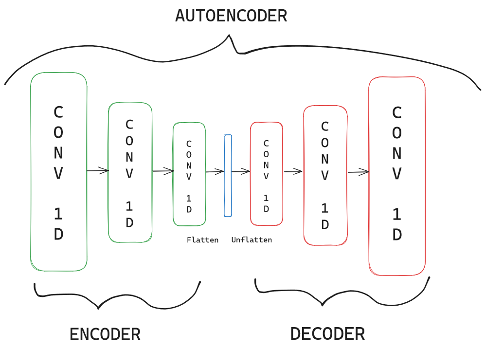
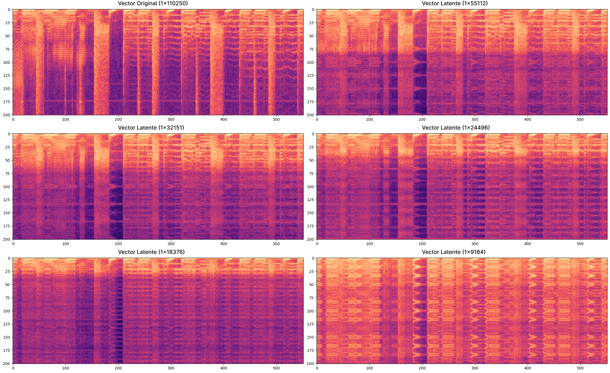
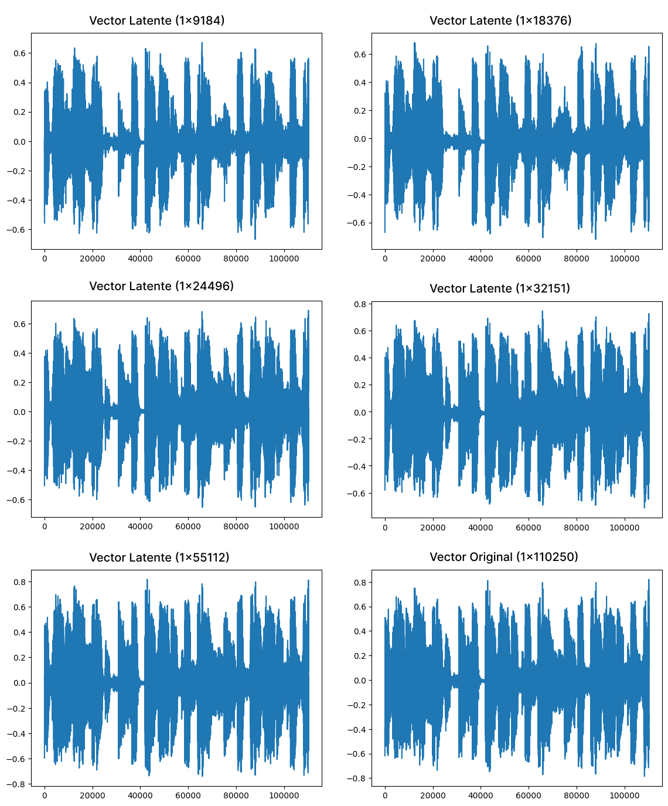
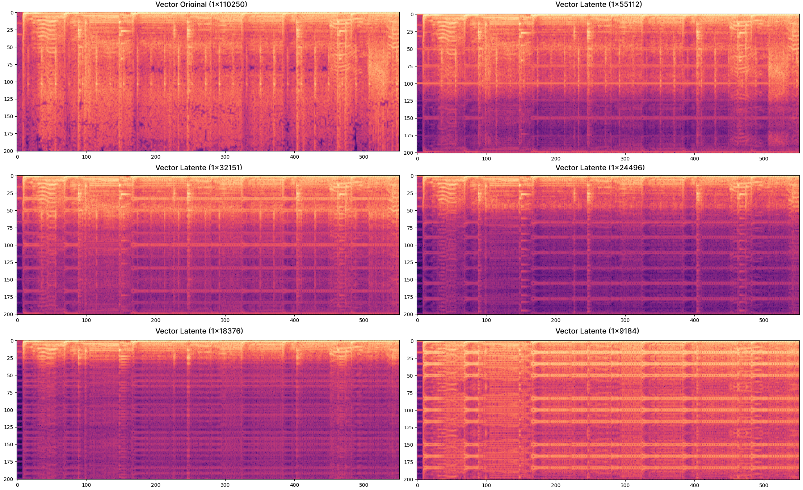
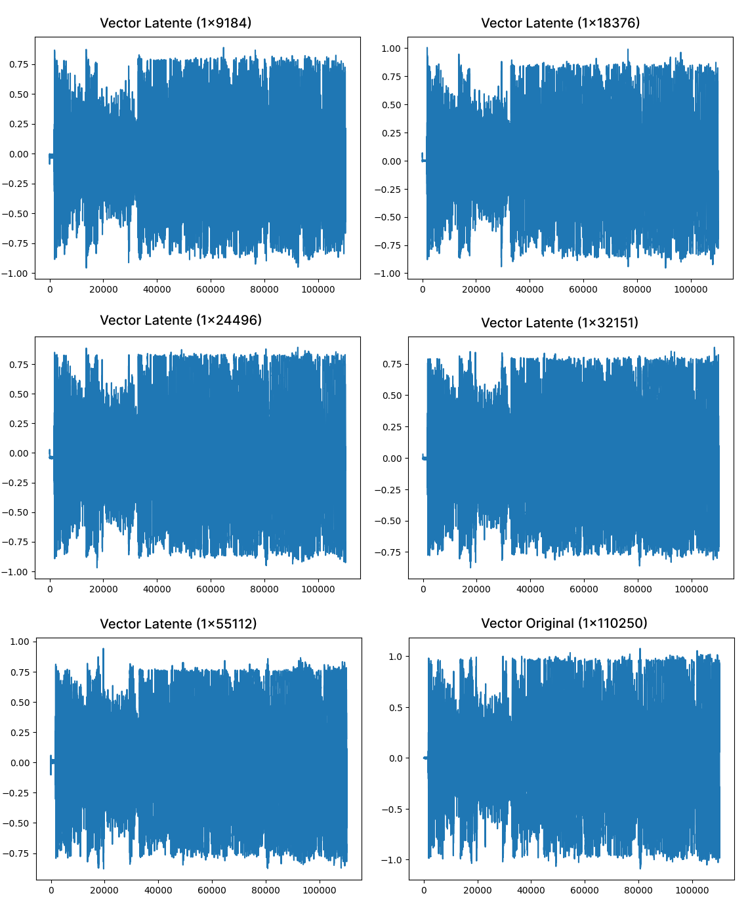

---
title: "Trabajo Práctico 4 - Autoencoder de música"
subtitle: "Tecnología Digital VI: Inteligencia Artificial"
author: [Federico Giorgi,Gastón Loza Montaña,Tomás Curzio]
date: "26/11/23"
geometry: "left=3cm,right=3cm,top=2.5cm,bottom=2.5cm"
lang: "es"
...

# Encodear canciones en vectores latentes

Para este primer inciso, dado que en principio no teníamos mucha información acerca de qué tipo de estructuras de redes eran convenientes para este tipo de problemas, nos enfocamos en primer lugar de tener un código del modelo y entrenamiento que funcione correctamente. Una vez alcanzado ese objetivo, procedimos a probar algunas ideas registrando los experimentos con `wandb`.

Luego de un poco de investigación acerca de autoencoders para audio[^1] y algunos experimentos más, concluimos en una arquitectura de una red sencilla, muy similar a los autoencoders vistos en clase, utilizando la estructura que se puede ver en la Figura 1. Como funciones de activación, decidimos utilizar para todas las capas la función Tangente hiperbólica (`Tanh()` en PyTorch) dado que observando las waveforms de los audios, notamos que era necesario utilizar alguna función de activación que mantuviera los valores en el rango $[-1,1]$ como lo hace la función elegida ya que si no estaríamos perdiendo información relevante al encodear las canciones.

{ width=350px }

Principalmente, pudimos identificar que una de las consideraciones más importantates a tener en cuenta era la forma en la que se reducía la dimensionalidad a lo largo de las capas covolucionales. Realizar en primera instancia una capa que aumentara la dimensión a más de `1x110250`, ya sea por muchos canales de salida o por un stride chico, para luego reducirla abruptamente en las siguientes dos capas, generaba bastante ruido. En cambio, hacer que la primera capa tal vez no reduzca casi nada la dimensionalidad, pero sí reorganice la información en varios canales para luego reducir la dimensionalidad en las siguientes dos capas generó mejores resultados. 

Esta estrategia de ir disminuyendo de a poco o mantener los canales a lo largo de la red, para finalmente flattenear el tensor y obtener así nuestro vector latente, nos dio en general buenas codificaciones. Por ese motivo, seguimos con esta estrategia pero modificando los parámetros de la convoluciones (`output_channels`, `input_channels`, `stride`, `kernel_size` y `stride`). Por esta razón, por fines prácticos y de facilidad de probar varias alternativas, generamos variables en el código que definen estos hiperparámetros de las capas convolucionales.

Con distintas combinaciones de los hiperparámetros de las capas convolucionales realizamos experimentos que dejaran vectores latentes de distintos tamaños, hasta llegar al punto de que la canción sea prácticamente irreconocible. Los audios resultantes se pueden ver en la siguiente tabla, que utiliza la canción Music de Maddona como ejemplo.

|    Vector latente     |                                                                                                    |
|:----------------------|---------------------------------------------------------------------------------------------------:|
| 1x110250 (Original)   | [$\textcolor{blue}{link}$](https://drive.google.com/file/d/13dINLPdNFMA_Rz2TYi6Tr5xfH0_xIw-c/view) |
| 1x55112               | [$\textcolor{blue}{link}$](https://drive.google.com/file/d/1cnege9wbLe6OsE1E8LDJliZn1zqfrBRD/view) |
| 1x32151               | [$\textcolor{blue}{link}$](https://drive.google.com/file/d/1jql5XVD3KKCA10C2dFdnZXvLSiJ9QSPX/view) |
| 1x24496               | [$\textcolor{blue}{link}$](https://drive.google.com/file/d/1UY3wKQtwLF5gk3JVnVQCwwSjJQL_2Dgl/view) |
| 1x18376               | [$\textcolor{blue}{link}$](https://drive.google.com/file/d/1he1mJwi92Qtt95sVPn0LRAQI-YC0MCfH/view) |
| 1x9184                | [$\textcolor{blue}{link}$](https://drive.google.com/file/d/1-8SM5pMs8vOZSLXxOH3wCtGWIl2ycoSL/view) |

En cuanto a los otros hiperparámetros, tomamos las siguientes decisiones:

- En cuanto al `learning rate`, corrimos un `hyperopt` con algunas iteraciones y el resultado obtenido (aproximadamente $0.015$) fue muy cercano al `learning rate` que elegimos inicialmente de $0.02$. Corrimos algunos experimentos con el learning rate obtenido del `hyperopt` y la diferencia era prácticamente nula, entonces a fines de poder comparar entre los distintos experimentos que ya habíamos realizado, decidimos mantener este parámetro en $0.02$.
- Para la definición de cantidad de `epochs`, luego de correr varios experimentos, como se puede ver en la Figura 2, notamos que luego de aproximadamente las $20$ épocas, ya no se observa una disminución significativa en la función de pérdida, por lo que decimos dejar este hiperparámetro en $40$ ya que era el doble de dónde veíamos cierto estancamiento en la función de pérdida pero aún manteníamos un tiempo de entrenamiento bastante bajo que nos permitiera experimentar de manera rápida.
- Con respecto al `batch size` decimos dejar el tamaño que venía dado en el notebook de ejemplo del clasificador y no tuvimos necesidad de alterarlo. 

{ width=450px }

Para no solo evaluar la eficiencia del autoencoder en base a cómo se escucha el audio, también observamos como difieren tanto la waveform como el espectograma de la canción original con los de los distintos audios encodeados y luego decodeados, observados en la tabla. Se pueden ver los resultados en las Figuras 3 y 4.

Observando y escuchando, decidimos quedarnos como "vector de mínimo tamaño posible" el de `1x18376`, ya que consideramos que mantiene una similitud razonable con el audio original, a diferencia del vector de `1x9184`, que es prácticamente irreconocible. Con esto, ya podemos avanzar a un análisis exploratorio de los vectores latentes obtenidos.

[^1]: Deep Autoencoders for Music Compression and Genre Classification. Sitio web:  [$\textcolor{blue}{aquí}$](https://www.pgrady.net/music-compression-web/)

# Análisis exploratorio de vectores latentes

Para el análisis exploratorio de los vectores latentes procedimos a probar distintos métodos vistos a la largo de la materia que nos permita adquirir información interesante.

En primer lugar, exploramos qué resultaba de hacer un clustering con `k-medias`. Para ello, ejecutamos el algoritmo de la libería `sklearn` con valores crecientes de `k` para evaluar cómo varía la función que mide la variabilidad intra cluster para poder observar en cuántos clusters se podría dividir los vectores latentes, con la expectativa que sea una cantidad similar a la cantidad de géneros a los que pertenecen las canciones. Como se puede ver en la Figura 5, aún con `k` igual a $40$ el modelo sigue con valores elevados de la función objetivo, y no se logra obervar ningún "codo" en el gráfico. Por lo tanto, es claro notar que aún los vectores latentes más chicos (de `1x9184`), tienen demasiados atributos y por ende muchas dimensiones para que el algoritmo de `k-medias` puede encontrar una clustering relativamente chico. Por ese motivo, dado que el dataset cuenta con 10 géneros, procedimos a computar el algoritmo de todas formas con `k` igual a $10$ y medir la completitud y homogeneidad entre el clustering resultante y las labels de géneros originales, para ver si se acercaba a separar por género. Se pueden observar los resultados en la tabla a continuación.

|    Vector latente     | Score Homogeneidad | Score Completitud |
|:----------------------|-------------------:|------------------:|
| 1x110250 (Original)   |             0.0095 |            0.2799 |
| 1x55112               |             0.0091 |            0.2920 |
| 1x32151               |             0.0105 |            0.2857 |
| 1x24496               |             0.0095 |            0.2794 |
| 1x18376               |             0.0095 |            0.2802 |
| 1x9184                |             0.0099 |            0.2688 |

{ width=350px }

Podemos notar que si bien no hay diferencias significativas en el score de homogeneidad ni de completitud, se puede ver una relativa disminución de los scores a medida que los vectores latentes son más chicos lo cual sostendría la idea de que además de escucharse peor los audios, también se pierde información para la clasificación de los géneros. Sin embargo, el impacto del tamaño del vector latente en los scores no es tan fuerte como esperábamos. Nuevamente, creemos que esto se debe a que la gran dimensión de los vectores dificulta al algoritmo de k-medias realizar buenos clusters.

Otro de los métodos que realizamos en esta exploración es la análisis de componentes principales (PCA). Para ello, utilizamos el método ya provisto en `sklearn.decomposition` para ejecutar el análisis, habiendo previamente escalado los valores de los vectores, como se suele hacer antes de realizar un PCA.

{ width=550px }

Para observar resultado del análisis, decidimos graficar los vectores en el nuevo espacio vectorial dado las 3 componentes principales. Como podemos observar en la Figura 6, para ninguno de los tamaños de vectores latentes ni para el original se observa una diferenciación clara entre las canciones. Esto muy probablemente se deba al mismo motivo por el que no funcionó `k-medias`. Dada la gran cantidad de atributos, se vuelve dificil poder visualizarlos en tan solo 3 dimensiones.

Por último, para poder observar si la información relevante para la clasificación en géneros de las canciones se ve afectada o no por el proceso de codificación, procedemos a realizar para cada tamaño de vector latente y el vector original árboles de decisión para entrenar la clasificación de las canciones en géneros con `sklearn.tree`. Entrenamos este clasificador con aquellas canciones que estuvieron involucaras en la configuración de la red del autoencoder (sets de training y validación) y evaluamos con las que fueron usadas para evaluar el autoencoder. En la siguiente tabla se pueden ver los resultados de los experimentos.

|    Vector latente     | Test Accuracy |
|:----------------------|--------------:|
| 1x110250 (Original)   |          0.16 |
| 1x55112               |          0.15 |
| 1x32151               |          0.15 |
| 1x24496               |          0.11 |
| 1x18376               |          0.10 |
| 1x9184                |          0.10 |

Como se puede observar, la perfomance del modelo de árbol de decisión es baja para todos los tipos de vectores. Sin embargo, en esta oportunidad se puede notar una relativa disminución de la perfomance de predicción a medida que se disminuye la dimensión de los vectores latentes. En particular, para los tamaños `1x18376` y `1x9184` la capacidad de predicción del modelo es practicamente nula dado que se cuentan con 10 clases (los 10 géneros) y una accuracy de $0.10$, es decir se está prediciendo al azar.

A lo largo de este análisis exploratorio, si bien las diferencias en clasificación y clustering de los vectores en base a sus géneros no fueron del todo contundentes, en conjunto con las comparaciones en al audio, los espectogramas, las waveforms y las evoluciones de la función de pérdida de validación a lo largo del entrenamiento del autoencoder; el contraste entre los diferentes vectores latentes es considerablemente observable.

# Encodeo de música nueva

Con la red definida, en un principio no se podría encodear música nueva, a no ser que tanto su sample rate como su tamaño original sea el mismo que el de los audios del dataset que estamos utilizando para entrenar y validar nuestra red.

Para poder hacerlo, hay algunas opciones:

1. Adaptar el audio que querramos encodear para cumplir los requisitos de la red.
2. Adaptar la red para el sample rate y tamaño original de aquello que querramos encodear.
3. Adaptar el sample rate que viene por defecto al del audio que querramos encodear, y reducir el tamaño del mismo a los requisitos de la red (recortandolo a 5s como los demás).

Tras el siguiente proceso pudimos encodear música nueva.

1. Entrenar la red normalmente, con el dataset otorgado.
2. Nuestro audio era stereo (2 channels) así que lo pasamos a mono con un convertidor online.
3. Una vez convertido a mono, cortamos un fragmento de 5 segundos con el código provisto.
4. Así, el vector de tamaño `1x220500`, que no cumple con las características que necesita la red (`1x110250`). Nuestra hipótesis es que esta diferencia en tamaño se debe a que el sample rate es $44100$ en lugar de $20500$ como los audios del dataset, justamente el doble de sample rate, el doble de tamaño. Para resolverlo, utilizamos la función de `resampling()` de PyTorch, obteniendo así un vector con las características necesarias. 
5. Realizamos un forward en la red con nuestro vector de audio nuevo una vez que cumplía las características necesarias.
6. Obtuvimos el audio reconstruido, así como su espectograma y waveform.
7. Repetimos el proceso para distintos tamaños de vectores latentes y obtuvimos los que se pueden ver en la siguiente tabla.

|       Vector latente       |                                                                                                    |
|:---------------------------|---------------------------------------------------------------------------------------------------:|
| 2x220500 (Original)        | [$\textcolor{blue}{link}$](https://drive.google.com/file/d/187JI_48yZ3JzzCX7yFjkjbNhRiXs7XL8/view) |
| 1x110250 (Resampled Mono)   | [$\textcolor{blue}{link}$](https://drive.google.com/file/d/1VqXBI28SHH_S5FwTK8ulkrXqhUEoBHRs/view) |
| 1x55112                    | [$\textcolor{blue}{link}$](https://drive.google.com/file/d/1zZUDSQ-4oow4DsLCeeUY6AXOMJ76ubYm/view) |
| 1x32151                    | [$\textcolor{blue}{link}$](https://drive.google.com/file/d/1bX3rKy501_6wxxxxbSD5QDhI6VJj0P2s/view) |
| 1x24496                    | [$\textcolor{blue}{link}$](https://drive.google.com/file/d/1kFnFMuga7pXgirngLSn2yKPYXz7MXXCM/view) |
| 1x18376                    | [$\textcolor{blue}{link}$](https://drive.google.com/file/d/1iKh6sA3N_pj4wPND89SY3ncuAebUHag-/view) |
| 1x9184                     | [$\textcolor{blue}{link}$](https://drive.google.com/file/d/1vzabQcLiIM83eEDDUIXcQQewkxDjrhkz/view) |

A modo de ejemplo, en la tabla hay sólo uno de los audios que probamos pero en la notebook se pueden probar los 4 audios que experimentamos, intentando que sean de distintos generos (rap, trap, disco, house) para ver como se comportaban. Los resultados fueron similares.

Al final, no tuvimos que editar el valor de Sample Rate hardcodeado, ya que nuestro nuevo audio funcionaba con el sample rate de 20500 tras hacer el `resampling()`, lo cual nos da mas certeza de que nuestra hipótesis sobre la diferencia del tamaño es correcta.

Al igual que para la música original del dataset, obtuvimos los espectogramas y waveforms del audio resampleado sin pasar por la red y del resultante de decodear los distintos vectores latentes, para poder observar la diferencia entre los distintos audios no solo de manera auditiva si no también visual. Se puede ver en las Figuras 7 y 8.

# Generación de música nueva

Hemos visto en clase como este tipo de autoencoders que hemos programado, no son lo mejor para generar contenido nuevo. Es por eso, que han surgido otros modelos, como pueden ser VAE o GAN. Sin embargo, se pueden realizar experimentos como generar vectores random del tamaño del espacio latente y pasarlos por el `Decoder` o incluso promediar vectores latentes de otras canciones y decodearlos. 

Este tipo de experimentaciones son las que probamos hacer y, si bien lo obtenido no es lo mas satisfactorio, logramos generar audio completamente nuevo a partir de nuestra red.

## Promediando vectores latentes de canciones existentes y decodeandolos

Para esto realizamos el forward en testing con la red entrenada, nos guardamos los vectores latentes que quedaban tras el encoding, agarramos los primeros tres y los promediamos. Luego, pasamos esos nuevos vectores latentes por el `Decoder`. Los resultados se pueden escuchar en la siguiente tabla.

|    Vector latente     |                                                                                                    |
|:----------------------|---------------------------------------------------------------------------------------------------:|
| 1x55112               | [$\textcolor{blue}{link}$](https://drive.google.com/file/d/1GbzApWBG1a66m9W4T1HZvjhLXoeMHter/view) |
| 1x32151               | [$\textcolor{blue}{link}$](https://drive.google.com/file/d/1oCOWgZ_WdHu3p_gRbIvuM33tBpB5aZmM/view) |
| 1x24496               | [$\textcolor{blue}{link}$](https://drive.google.com/file/d/1ZDu6qpxWOuQJaAKdgJoBt7mQcrMashZ0/view) |
| 1x18376               | [$\textcolor{blue}{link}$](https://drive.google.com/file/d/1YD1UZgzRxDhVQ0ZORYNsZu5fwHd4uhmy/view) |
| 1x9184                | [$\textcolor{blue}{link}$](https://drive.google.com/file/d/10NIcfuT6-yWLFH12GHkXG1L99G-PZMlj/view) |

En los resultados, se nota la presencia de las canciones pero no queda nada muy coherente, por lo que probamos a utilizar todas canciones del mismo género, obteniendo lo siguiente.

|    Vector latente     |                                                                                                    |
|:----------------------|---------------------------------------------------------------------------------------------------:|
| 1x55112               | [$\textcolor{blue}{link}$](https://drive.google.com/file/d/1HkZTkIVuLNim9CrjFuC3W-1WVvb0MaR1/view) |
| 1x32151               | [$\textcolor{blue}{link}$](https://drive.google.com/file/d/1M2l1irHORme9SEk-0DVxJGdT-9NUuKcL/view) |
| 1x24496               | [$\textcolor{blue}{link}$](https://drive.google.com/file/d/13fRQQuwi3AoHNCtTTphjSR6B2FG-uLX5/view) |
| 1x18376               | [$\textcolor{blue}{link}$](https://drive.google.com/file/d/1IYqgbLDOgO2EEPvuwmnWQ68D-eolSmlF/view) |
| 1x9184                | [$\textcolor{blue}{link}$](https://drive.google.com/file/d/1iiiwaQ0RN8edo8b01Ckd_J8parj2Oev-/view) |

Como nos funcionó un poco mejor, quisimos llevarlo un poco al extremo y probar que sucedería si en lugar de utilizar solo tres canciones, poníamos todas las canciones del género que hay en el dataset y logramos los siguientes resultados.

|    Vector latente     |   |
|:----------------------|--:|
| 1x55112               | [$\textcolor{blue}{link}$](https://drive.google.com/file/d/1kfC0EV-RAfelz72hA8Rv4q-xDkDkxvvb/view) |
| 1x32151               | [$\textcolor{blue}{link}$](https://drive.google.com/file/d/1b6DQwjYp7NopbCYL5t-oFBtbLUmGa9db/view) |
| 1x24496               | [$\textcolor{blue}{link}$](https://drive.google.com/file/d/1Wsy7OBQwa33Vu4qzdtF9uUtpSOQ3bH3v/view) |
| 1x18376               | [$\textcolor{blue}{link}$](https://drive.google.com/file/d/1XhoDOBk_TPkoZewNWry86IwgvbqH0rbm/view) |
| 1x9184                | [$\textcolor{blue}{link}$](https://drive.google.com/file/d/1f9DlYC9T6FIDAMAL7kPJqrJ6KvSH5x_Q/view) |

A modo de ejemplo en estas tablas utilizamos el genero jazz, ya que nos pareció el más interesante, pero en la notebook se puede cambiar el género y escuchar los resultados para cualquiera de los géneros en el dataset.

## Generando nuevos vectores latentes de manera aleatoria

Para este test, generamos vectores aleatorios del tamaño que quedan los vectores latentes para las distintas redes y pasamos esos vectores por el decoder (entrenado con el dataset original). Logramos ver porqué se nos había dicho que este modelo no era lo mas interesante para generación, ya que obtuvimos simplemente "ruido blanco". No varió mucho con los distintos modelos, pero de todas formas dejamos los resultados en la siguiente tabla.

|    Vector latente     |   |
|:----------------------|--:|
| 1x55112               | [$\textcolor{blue}{link}$](https://drive.google.com/file/d/1ZZ_jml79Nk6voNISIuw5nXTfR4TvsthU/view) |
| 1x32151               | [$\textcolor{blue}{link}$](https://drive.google.com/file/d/1FAEr4QH9PJjUbuwLUootrOfwYAH9aEd8/view) |
| 1x24496               | [$\textcolor{blue}{link}$](https://drive.google.com/file/d/1OMTeYrs7YOpGZQh31Nu6vFH0epTKwklg/view) |
| 1x18376               | [$\textcolor{blue}{link}$](https://drive.google.com/file/d/1VOV0NYzTuU4uvJcTBezbdbIv0k_iX4LE/view) |
| 1x9184                | [$\textcolor{blue}{link}$](https://drive.google.com/file/d/1mu0pJpnqd2mh4wsYPQ5ODeVTZ4SpNw_2/view) |